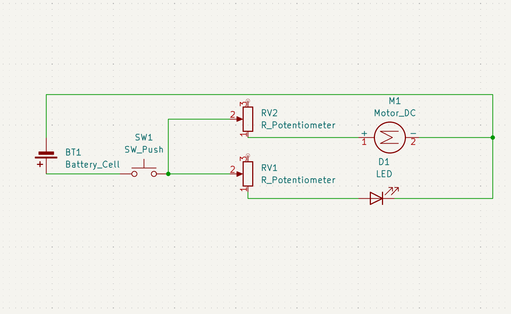
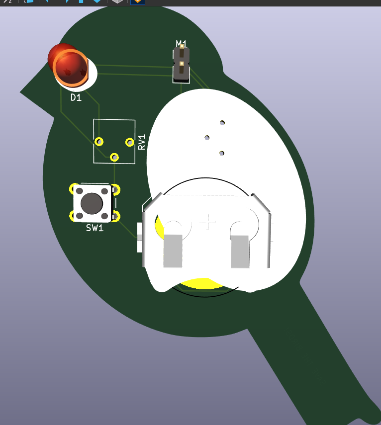
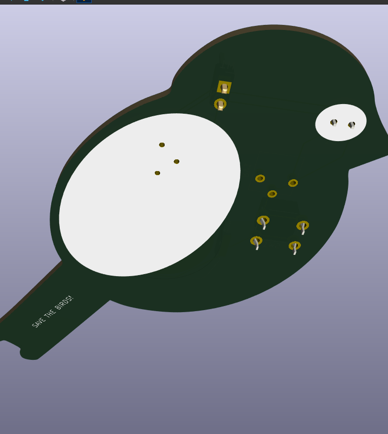

# Description
My project is a bird with a button that when clicked, lights up an LED and vibrates a motor. The LED is supposed to be the eye of the bird, and the vibration is its stomach growling. There are also potentiometers to adjust the intensity of the light or vibration. This is my first PCB.

# Materials
- 1x Battery
- 1x Push Button
- 2x Potentiometers
- 1x LED
- 1x Vibration Motor

# Screenshots

# Slack Username
`Vikhyat Konchada`
